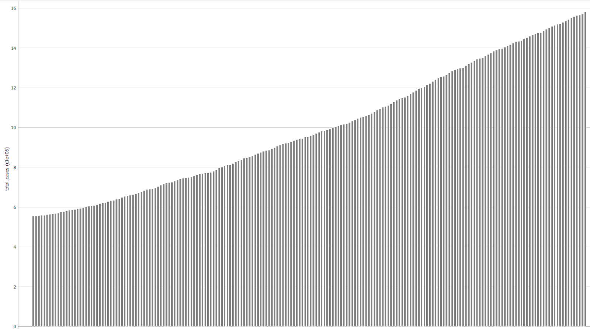
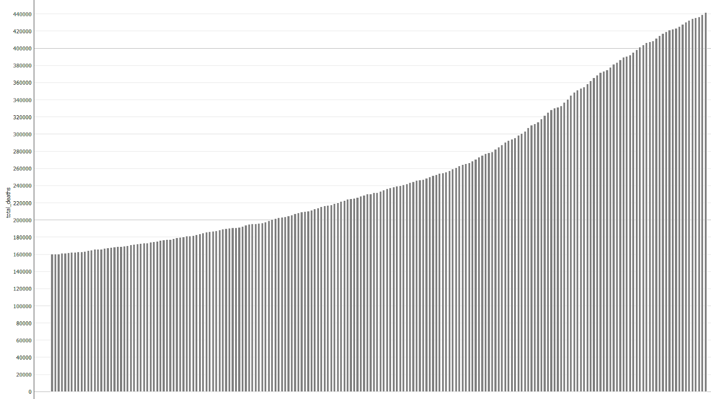
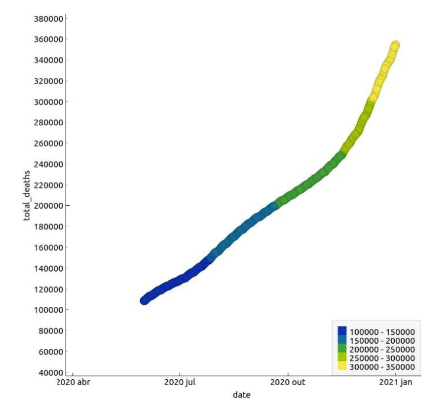

# Projeto `Avaliação do impacto da subnotificação na predição de indicadores de evolução da COVID - 19 (número de casos e óbitos)`
# Project `Evaluation of the impact of underreporting on the prediction of COVID - 19 evolution indicators (number of cases and deaths)`

# Apresentação

O presente projeto foi originado no contexto das atividades da disciplina de pós-graduação [*Ciência e Visualização de Dados em Saúde*](https://github.com/datasci4health/home), oferecida no primeiro semestre de 2021, na Unicamp.

 |Nome  | RA | Especialização|
 |--|--|--|
 | Diogo Brandão  | 227099  | Computação|
 | Juliana Rodrigues Pinto | 107619  | Saúde|
 | Laura Moretti Aiello  | 178176  | Saúde|
 | Miguel Henrique Nicodemus de Souza Pinto  | 156777  | Computação|

# Descrição Resumida do Projeto

A Covid 19 está afetando a população brasileira de uma forma complexa. O presente trabalho objetiva avaliar a evolução do vírus em diferentes países para identificar a existência de subnotificação nos números de casos e mortes e tentar predizer o impacto da subnotificação durante a pandemia.

# Vídeos do Projeto

## Vídeo da Proposta

[Video Projeto Ciência e Visualização de Dados em Saúde](https://drive.google.com/file/d/1QKpGMJFm76yzsFowA0n4_coLLJ7RuWdh/view?usp=sharing)

## Vídeo da Apresentação Final

[Video da Apresentação Final Ciência e Visualização de Dados em Saúde](https://drive.google.com/file/d/1ZJvP5R7AJtXpXe7foxbgJfHhpihPsWHl/view?usp=sharing)

# Slides do Projeto

## Slides da Proposta

Para a proposta, utilizou-se o presente arquivo README.md.

## Slides da Apresentação Final

[Slides da Apresentação Final Ciência e Visualização de Dados em Saúde](https://docs.google.com/presentation/d/1JefhThA-SJuGK7R4_zHKYI-xU954iBkvFIvg0qMvUpQ/edit#slide=id.ge1e6915770_0_70)

# Introdução e Referenciais de Teóricos

COVID-19 (coronavirus disease) é a denominação dada à doença causada pelo novo coronavírus (CoV-2) relacionado à síndrome respiratória aguda grave (SARS), originalmente descoberto em 2019 na China. Os sintomas causados pela infecção por esse agente variam de sua forma leve e moderada semelhante a um resfriado comum até sua forma grave que compreende manifestações como dispneia, baixa saturação de oxigênio e disfunção de múltiplos órgãos (1,2). 

Devido às altas taxas de transmissão e mortalidade, a COVID-19 foi considerada uma pandemia global em 11 de março de 2020 pela Organização Mundial da Saúde (OMS). Sua rápida disseminação resultou em grandes impactos econômicos, sociais e em uma importante crise nos sistemas de saúde (3). À vista dessa situação, diversas ações estão sendo feitas para conter a pandemia como medidas restritivas e de distanciamento social, além do desenvolvimento de estudos para caracterização do vírus, definição de métodos de tratamento e adoção de políticas públicas (4).

A tomada de decisões e o monitoramento da evolução da doença têm sido, contudo, um grande desafio dentro de um cenário pandêmico devido à falta de informações sobre os principais indicadores da doença. Tais dificuldades são atribuídas pelo insuficiente número de testes diagnósticos confirmatórios aplicados em diversos países em função da falta de kits e infraestrutura apropriada e de fatores culturais (4,5). Desse modo, a decorrente subnotificação dos dados torna incerta a predição da progressão da doença e a avaliação da efetividade das medidas tomadas (4,6).

A fim de consolidar dados reais sobre os indicadores da doença, diversas metodologias têm sido propostas para estimar a subnotificação em vários países. O desenvolvimento dos diferentes métodos para subnotificação empregam parâmetros variados como a aplicação de um modelo adaptativo que considera as características de cada país por Krantz et al. (2020), a utilização de técnicas de regressão a partir de dados de hospitalização por Ribeiro et al. (2020) e a comparação entre a diferença de casos de infecção respiratória aguda severa em 2020 (após o Covid) e o total de casos esperados nos últimos anos (2016-2019) por Paixão et al. (2020).

Dentre as diversas metodologias recentemente apresentadas, o estudo realizado por Jagodnik et al. (2020) compreende um modelo que considera dados demográficos e a vulnerabilidade de cada faixa etária. Sabe-se que a fração populacional mais jovem apresenta um risco menor de desenvolver quadros severos da doença que os segmentos de idade mais avançada, sendo observada uma alta taxa de mortalidade no público com mais de 80 anos de idade, segundo dados da Organização Mundial da Saúde (10). Dessa forma, a vulnerabilidade é um fator que pode alterar significativamente as análises de subnotificação, devendo ser ajustada no modelo desenvolvido  (9). 

Além disso, o cálculo do número real de casos acumulados no trabalho de Jadodnik et al. (2020) considera a taxa de letalidade do país tendo em vista que esse é um parâmetro mais consolidado e menos variável. Na Coréia do Sul, a razão de óbitos por casos confirmados foi descrita como um dos dados mais fidedignos uma vez que esse foi um dos poucos países com capacidade de aplicar testes confirmatórios em massa, sendo, por conseguinte, utilizado como padrão no modelo (9).

Diante do contexto de incertezas e das discrepâncias no cenário internacional, a vacinação em massa apresenta-se como a estratégia mais eficaz para conter a pandemia de COVID-19. Entretanto, tal medida depara-se com diversas dificuldades como a necessidade de implementação de infraestrutura e de um sistema de distribuição e armazenamento eficiente, a colaboração política e industrial para gerenciamento do processo, a aceitação da vacina pela população e a mutação da partícula viral (11,12). Dessa forma, ainda que vacinas seguras e eficazes tenham sido desenvolvidas, um tempo considerável será necessário para que a situação mundial se normalize (13). Com isso, a construção de um modelo para predição do progresso da doença a partir de dados reais e que considerem o problema de subnotificação poderá fornecer informações relevantes e mais precisas para elaboração de estratégias futuras de enfrentamento das questões acerca da pandemia. 

# Perguntas de Pesquisa

Como pressupostos fundamentais para orientação do projeto foram utilizadas as seguintes perguntas de pesquisa:

- Qual o presente cenário do número de casos e de mortes em diferentes países?
- Houve subnotificação nos números de casos e morte pra diferentes países?
- Como os casos de subnotificação podem interferir nas predições de indicadores futuros de COVID-19?
- Quais foram os efeitos da vacinação nos indicadores de subnotificação?

# Objetivos do Projeto

Esse projeto teve como objetivos estimar os casos de subnotificação de COVID-19 e, a partir dos dados ajustados, desenvolver um modelo para predição de indicadores de progressão da doença.

# Metodologia

A metodologia desse estudo foi baseada nas estimativas propostas por Jagodnik et al. (2020), obedecendo os mesmos pressupostos apresentados. O número de óbitos e o número de casos confirmados foram obtidos do Centro de Ciência e Engenharia de Sistema da Universidade Johns Hopkins (14). No cálculo do Fator de Vulnerabilidade, foram considerados as taxas de letalidade do país referência (15) e o tamanho populacional foi avaliado com estratificação dos grupos etários (16). Os países comparados nesse trabalho foram o Brasil e os Estados Unidos (EUA). 

## Ajuste da taxa de letalidade 

A taxa de letalidade (CFR) é calculada a partir da razão do número de óbitos pelo número de casos confirmados. Sabe-se que na infecção por COVID-19, pode haver um atraso médio de 14 dias entre a data do óbito e a data de confirmação do caso da doença. O cálculo passa a ser mais fidedigno ajustando a taxa pelo tempo médio entre a confirmação do caso e o óbito. Desta maneira, no presente estudo foi calculada a CFR bruta e a CFR ajustada, conforme descrito a seguir:

a)  	CFR bruta: corresponde ao número de óbitos em relação ao número de casos da doença em um determinado dia ou período. Por exemplo, no dia 01/06/2021 foram registrados no Brasil um total acumulado de 16.624.500 casos confirmados de COVID-19 e 465.199 óbitos, o que corresponde a uma CFR bruta de 2.80%.

b)  	CFR ajustada: corresponde ao número de óbitos em um determinado dia ou período, em relação ao número de casos confirmados 14 ou 10 dias antes da data de registro dos óbitos. Por exemplo, como citado acima, em 01/06/2021 foram registrados no Brasil um total acumulado de 465.199 óbitos. Se for considerado o número de casos confirmados registrados em 22/05/2021 (10 dias antes), que corresponde a 16.047.400 casos, temos uma CFR ajustada de 2.90%.

O tempo considerado nesse estudo foi de 14 dias, conforme demonstrado na Equação 1.

CFR ajustada = Óbitos (t) / Casos (t-14)    (**Equação 1**)

Sendo, óbitos (t) = número de óbitos no tempo t e casos (t-14) = número de casos 14 dias antes do tempo t.

Nesse trabalho, o CFR notificado foi comparado com a taxa de letalidade ajustada. A CRF foi calculada diariamente de 01 a 31/05/2021 e a CRF ajustada considerou o registro de óbitos diários de casos confirmados obtidos a partir de 17/04/2021 (t-14 dias).

Valores de CFR ajustada > CFR bruta pode indicar subnotificação, ou atraso na notificação dos casos confirmados de COVID-19, o que pode influenciar em alguns indicadores da doença.

Para avaliar a significância desta variação, os valores de CFR bruta e CFR ajustada calculados para cada país foram estatisticamente comparados, aplicando o teste não paramétrico de Wilcoxon. Além disso, esses indicadores de letalidade foram comparados entre o Brasil e os Estados Unidos com o teste não paramétrico de Wilcoxon. As análises estatísticas foram realizadas com o software GraphPad Prism 8.0 com IC considerado de 95%.

## Estimativa de População infectada acumulada 

O método selecionado para estimativa da subnotificação é realizado a partir da comparação do país analisado (país alvo) com um país que apresenta um CFR mais confiável, sendo considerado nesse caso, a Coreia do Sul (país referência).

As variações de vulnerabilidade entre as faixas etárias foram padronizadas e ajustadas a partir do fator de vulnerabilidade (FV) apresentado na Equação 2. 

FV= ∑ni  (Pop alvo / pop ref) X CRFi   (**Equação 2**)

Sendo pop alvo= fração da população com idade i para o país alvo e Pop ref= fração da população com idade i para o país referência (Coréia do sul) e CRFi= taxa de letalidade do país referência para a idade i. 

Cada CFRi é apresentado na Tabela 1. 

*Tabela 1 - Taxa de letalidade do país de referência (Coréia do Sul) por faixa etária*

Faixa Etária | CFR 
----- | -----
0-9 | 0,0000
10-19 | 0,0000
20-29 | 0,0002
30-39 | 0,0005
40-49 | 0,0010
50-59 | 0,0030
60-69 | 0,0127
70-79 | 0,0640
80+ | 0,2048

A estimativa da população infectada acumulada (Equação 3) foi feita considerando o número de óbitos acumulados do país alvo, a diferença no tempo de confirmação do caso e do óbito,(14 dias), CFR do país alvo e o ajuste pela taxa de vulnerabilidade.

Estimativa de casos (t) = óbitos (t+d)/ (FV x CFRref)   (**Equação 3**)

Sendo, óbitos (t+d) = número de óbitos obtidos 14 dias após o tempo t, FV= fator de vulnerabilidade e CFRref= taxa de letalidade do país referência (Coréia do Sul).

# Bases de Dados e Evolução

## Bases Estudadas mas Não Adotadas

As bases de dados abaixo foram avaliadas, porém descartadas pelos motivos apresentados abaixo:

Base de Dados | Endereço na Web | Resumo descritivo
----- | ----- | -----
Distribuição Geográfica de COVID-19 pelo mundo | https://www.ecdc.europa.eu/en/publications-data/download-todays-data-geographic-distribution-covid-19-cases-worldwide | Base que contém dados históricos do ano de 2020 com os indicativos: número de casos, mortes, país, continentes, casos cumulativos de COVID por 14 dias, e dados populacionais. Não adotada, pois as análises podem ser feitas pela base adotada e mais completa.

Para avaliação da aplicabilidade da base de dados ‘Distribuição Geográfica de COVID-19 pelo mundo” com os objetivos propostos por esse projeto, foram analisadas as variáveis números de casos e mortes, comparando a partir do tempo, localização geográfica e número da população. O restante das informações puderam ser excluídas uma vez que não contemplavam os objetivos estabelecidos. 
A partir da análise exploratória dos dados, verificou-se uma forte correlação entre o número de casos e mortes (0,823). As correlações se mantiveram positivas para as variáveis: números de casos e população (0,466) e número de mortes e população (0,460). 

**Correlação**

Os resultados das estatísticas descritivas das variáveis numéricas mais relevantes são apresentados na Figura abaixo. 

**Estatísticas descritivas**

As variáveis também podem ser comparadas e estudadas a partir dos gráficos de dispersão conforme demonstrado.

**Gráfico de dispersão do número de casos em função do tempo (meses)**

**Gráfico de dispersão do número de mortes em função do tempo (meses)**

Observa-se um aumento no número de casos de COVID-19 ao longo dos meses, com uma prevalência no continente americano. Já o número de mortes apresentou maiores índices no mês de abril e dezembro, também com prevalência no continente americano. 

Embora a base de dados apresente dados relevantes, essa não foi considerada uma vez que essas análises puderam também ser realizadas de forma mais completa e mais condizentes com o objetivo proposto a partir da base adotada. 

Base de Dados | Endereço na Web | Resumo descritivo
----- | ----- | -----
Teste para COVID-19 | https://www.ecdc.europa.eu/en/publications-data/covid-19-testing | A base traz informações sobre as quantidades de testes realizados e positivados por semana e país. Não adota por não conter todos os países que devem ser considerados no projeto.

Para avaliação dessa base de dados, foram selecionados os parâmetros: país, novos casos, testes feitos e testes positivos. Os dados considerados não relevantes foram excluídos.
A análise exploratória desses dados foi feita a partir do estudo de correlação entre variáveis, gráficos de dispersão e estatísticas descritivas. 

**Correlação**

Conforme apresentado na figura, o número de casos obteve uma forte correlação com a taxa de testes positivados (0,809) e com o número de testes feitos (0,683). O número de população também apresentou forte correlação com os testes feitos (0,661) e novos casos (0,630). Desse modo, podemos constatar que quanto maior o número da população, mais testes serão feitos e maior a taxa de positivos e, portanto, mais novos casos ocorrerão.

**Gráfico de dispersão taxa de testes feitos em função do número de novos casos - correlação positiva**

**Gráfico de dispersão taxa de testes positivos em função do número de novos casos**

Verifica-se uma correlação positiva entre número de novos casos e testes feitos no primeiro gráfico enquanto que no segundo gráfico, não é constatada uma correlação clara entre os novos casos e a taxa de testes positivos.

**Estatísticas descritivas das variáveis**

Embora essa base de dados contenha informações relevantes a serem utilizadas, por exemplo, para cálculo dos casos não notificados, essa não apresenta todos os países de interesse para as avaliações propostas pelo projeto,  tendo sido, portanto, dada preferência à base de dados adotada mais completa. 

## Bases Estudadas e Adotadas

As bases abaixos foram escolhidas para a análise do projeto.

Base de Dados | Endereço na Web | Resumo descritivo
----- | ----- | -----
owid-covid-data | https://github.com/owid/covid-19-data/tree/master/public/data | O dataset utilizado contém dados relacionados à COVID-19 e é mantido pela Our World in Data, uma plataforma digital especializada em expor dados de pesquisa de forma interativa. O dataset é atualizado diariamente e contém dados sobre casos confirmados, óbitos, hospitalização, testes e vacinação, além de informações relacionadas à população, IDH, expectativa de vida, entre outras variáveis de interesse a pesquisa.

Nesta análise utilizou-se o [Dataset Covid](https://github.com/MiguelNicodemus/DataSci-Pharmacologicals/blob/main/data/raw/owid-covid-data-20210618.csv), com 91.024 entradas de dados, 40.1% de dados faltantes e 59 features. As features (características) da base de dados estão descritas abaixo:

- ISO_Code (dado categórico): Código de identificação do país.
- Continent (dado categórico): Continente no qual o país está localizado.
- Location (dado categórico): Nome do país.
- Date (dado categórico): Data de notificação
- Total_cases (dado numérico): Número de casos acumulados
- New_cases (dado numérico): Número de novos casos por data de notificação
- New_cases_smoothed (dado numérico): ?
- Total_deaths (dado numérico): Número de óbitos acumulados.
- New_deaths (dado numérico): Número de  óbitos por data de notificação
- New_deaths_smoothed (dado numérico): ?
- Total_cases_per_million (dado numérico): Número de casos acumulados por 1 milhão de habitantes.
- New_cases_per_million (dado numérico): Número de novos casos por 1 milhão de habitantes por data de notificação.
- New_cases_smoothed_per_million (dado numérico): ?
- Total_deaths_per_million (dado numérico): Número de óbitos acumulados por 1 milhão de habitantes.
- New_deaths_per_million (dado numérico): Número de novos óbitos por 1 milhão de habitantes por data de notificação.
- New_deaths_smoothed_per_million (dado numérico): ?
- Reproduction_rate (dado numérico): Taxa de reprodução da Covid-19.
- ICU_patients (dado numérico): Número total de pacientes na unidade de terapia intensiva.
- ICU_patients_per_million (dado numérico): Número de pacientes na unidade de terapia intensiva por 1 milhão de habitantes.
- Hosp_patients (dado numérico): Número total de pacientes hospitalizados.
- Hosp_patients_per_million (dado numérico): Número total de pacientes hospitalizados por 1 milhão de habitantes.
- Weekly_ICU_admissions (dado numérico): Número de pacientes admitidos semanalmente na unidade de terapia intensiva.
- Weekly_ICU_admissions_per_million (dado numérico): Número de pacientes admitidos semanalmente na unidade de terapia intensiva por 1 milhão de habitantes.
- Weekly_hosp_admissions (dado numérico): Número de pacientes hospitalizados semanalmente.
- Weekly_hosp_admissions_per_million (dado numérico): Número de pacientes hospitalizados semanalmente por 1 milhão de habitantes.
- New_tests (dado numérico): Número de novos testes para Covid-19 realizados na data de notificação.
- Total_tests (dado numérico): Número total de testes para Covid-19 realizados.
- Total_tests_per_thousand (dado numérico): Número total de testes para Covid-19 realizados por mil habitantes.
- New_tests_per_thousand (dado numérico): Número de novos testes para Covid-19 realizados por mil habitantes na data de notificação.
- New_tests_smoothed (dado numérico): ?
- New_tests_smoothed_per_thousand (dado numérico): ?
- Positive_rate (dado numérico): Taxa de resultados positivos para teste de Covid-19.
- Tests_per_case (dado numérico): ?
- Tests_units (categórico): ?
- Total_vaccionations (dado numérico): Número total de vacinas aplicadas.
- People_vaccinated (dado numérico): Número total de pessoas vacinadas.
- People_fully_vaccinated (dado numérico): Número de pessoas vacinadas com a primeira e segunda dose.
- New_vaccinations (dado numérico): Número de vacinas aplicadas por data de notificação.
- New_vaccinations_smoothed (dado numérico): ?
- Total_vaccinations_per_hundred (dado numérico): Número total de vacinas aplicadas por cem habitantes.
- People_vaccinated_per_hundred (dado numérico): Número total de pessoas vacinadas por cem habitantes.
- People_fully_vaccinated_per_hundred  (dado numérico): Número de pessoas vacinadas com a primeira e segunda dose por cem habitantes.
- New_vaccinations_smoothed_per_million (dado numérico): ?
- Stringency_index (dado numérico):  Índice de Estringência de Resposta Governamental: medida baseada em nove indicadores de resposta, incluindo encerramentos de escolas, encerramentos de locais de trabalho, e proibições de viagens, redimensionada para um valor de 0 a 100 (100 = o mais rigoroso). 
- Population (dado numérico): Número de habitantes.
- Population_density (dado numérico): Densidade populacional.
- Median_age (dado numérico): Idade média da população.
- Aged_65_older (dado numérico): Número de habitantes com 65 anos ou mais (e menores de 70 anos). 
- Aged_70_older (dado numérico): Número de habitantes com 70 anos ou mais. GDP_per_capita (dado numérico): Produto Interno Bruto (PIB) per capita - soma das riquezas do país dividida pela população do país.
- Extreme_poverty (dado numérico): Porcentagem da população que vive em pobreza extrema.
- Cardiovasc_death_rate (dado numérico): Taxa de óbito por doenças cardiovasculares na população.
- Diabetes_prevalence (dado numérico): Porcentagem de prevalência de diabetes na população.
- Female_smokers (dado numérico): Porcentagem de fumantes do sexo feminino na população.
- Male_smokers (dado numérico): Porcentagem de fumantes do sexo masculino na população.
- Handwashing_facilities (dado numérico): Número de habitantes com acesso a instalações adequadas para higiene das mãos.
- Hospital_beds_per_thousand (dado numérico): Número de leitos hospitalares por mil habitantes.
- Life_expectancy (dado numérico): Expectativa de vida.
- IDH  (dado numérico): Índice de desenvolvimento humano.

**Dataset Covid após remoção das características irrelevantes**

A partir do Dataset Covid foram selecionadas somente as características (features) relevantes para as análises que serão realizadas, a fim de responder às perguntas de pesquisa propostas no presente projeto. Desta maneira, foram selecionadas somente as colunas com as seguintes features:

- Date
- Location
- Total_cases
- Total_cases_per_million
- New_cases
- Total_deaths
- Total_deaths_per_million
- New_deaths
- Total_vaccinations
- New_vaccinations
- Population
- Population_density
- Median_age
- Life_expectancy
- IDH

**Análise do cenário mundial da pandemia de Covid-19, considerando os dados relativos ao número de casos, óbitos e vacinação.**

Abaixo estão apresentados os gráficos de distribuição do total de casos (cumulativo), casos diários, total de óbitos (cumulativo), óbitos diários, total de vacinas (cumulativo) e pessoas vacinadas por dia, a nível mundial. 
Os gráficos apresentam a distribuição das notificações realizadas entre 02-11-2020 e 19-05-2021. Devido à limitação do Orange, que permite somente o input de 200 dados para a elaboração do gráfico de distribuição, foram selecionados somente os dados referentes às 200 notificações mais atuais.

*Gráfico 1: Total de casos acumulados de Covid-19 no mundo.*

*Gráfico 2: Número de casos diários de Covid-19 no mundo.*

*Gráfico 3: Total de óbitos acumulados por Covid-19 no mundo.*

*Gráfico 4: Número de óbitos diários por Covid-19 no mundo.*

*Gráfico 5: Total acumulado de vacinas aplicadas no mundo.*

*Gráfico 6: Número de pessoas vacinadas diariamente no mundo.*

**Features statistics**

As figuras 1 e 2 apresentam os gráficos de distribuição e estatística descritiva do dataset completo e das variáveis (features) relevantes que serão avaliadas pelo grupo.

*Figura 2. Gráfico de distribuição e estatística descritiva das variáveis selecionadas.*

A partir dos gráficos apresentados nas figuras 1 e 2 é possível inferir, que de modo geral, as variáveis do dataset não apresentam uma distribuição normal.
Para as variáveis relacionadas à vacinação é possível verificar uma alta porcentagem de dados faltantes. Em alguns casos é possível observar que 70% dos dados estão faltando.
No entanto, é importante ressaltar que o dataset apresenta dados de notificações realizadas desde janeiro de 2020, e a vacinação iniciou em alguns países a partir de dezembro de 2020. 

**Correlações entre características**

A correlação entre duas variáveis apresenta uma relação estatística entre elas. Variáveis fortemente correlacionadas (valor de r ⦥ 0.7) podem indicar a influência de uma sobre a outra.
A correlação entre as variáveis selecionadas foi avaliada aplicando-se o coeficiente de Spearman, uma vez que as variáveis não apresentam uma distribuição normal.
O resultado apresentado abaixo mostra uma forte correlação entre as variáveis: casos acumulados e óbitos acumulados; casos diários e óbitos acumulados; casos diários e casos acumulados; vacinação diária e total vacinados; casos diários e óbitos diários; óbitos diários e óbitos acumulados; óbitos diários e casos acumulados.

**Análise do cenário nacional da pandemia de Covid-19, considerando os dados relativos ao número de casos, óbitos e vacinação**

Abaixo estão apresentados os gráficos de distribuição do total de casos (cumulativo), casos diários, total de óbitos (cumulativo), óbitos diários, total de vacinas (cumulativo) e pessoas vacinadas por dia no Brasil. 
Os gráficos apresentam a distribuição das notificações realizadas entre 02-11-2020 e 19-05-2021. Devido à limitação do Orange, que permite somente o input de 200 dados para a elaboração do gráfico de distribuição, foram selecionados somente os dados referentes às 200 notificações mais atuais.

*Gráfico 7: Total de casos acumulados de Covid-19 no Brasil.*

*Gráfico 8: Número de casos diários de Covid-19 no Brasil.*

*Gráfico 9: Total de óbitos acumulados por Covid-19 no Brasil.*

*Gráfico 10: Número de óbitos diários por Covid-19 no Brasil.*

*Gráfico 11: Total acumulado de vacinas aplicadas no Brasil.*

*Gráfico 12: Número de pessoas vacinadas diariamente no Brasil.*

**Features statistics**

A figuras 3 apresenta o gráfico de distribuição e estatística descritiva das variáveis (features) selecionadas, considerando as notificações registradas no Brasil.

*Figura 3. Gráfico de distribuição e estatística descritiva das variáveis selecionadas (dados Brasil) .*

De acordo com os dados visualizados na figura 3 é possível inferir que as variáveis não apresentam uma distribuição normal.
Assim como no cenário mundial, as variáveis relacionadas à vacinação apresentam alta porcentagem de dados faltantes. Para o Brasil esta porcentagem é relativamente maior, pois, a vacinação no país começou a partir de janeiro de 2021.

**Correlações entre características**

A correlação entre as variáveis selecionadas foi avaliada aplicando-se o coeficiente de Spearman, uma vez que as variáveis não apresentam uma distribuição normal.
O resultado apresentado abaixo mostra uma forte correlação  (valor de r ⦥ 0.7) entre as variáveis: casos acumulados e óbitos acumulados; casos diários e óbitos diários; casos diários e casos acumulados.
É possível observar uma correlação moderada (valor de r ⦥ 0.5) entre as variáveis: vacinação diária e total vacinados; casos diários e óbitos acumulados; óbitos diários e óbitos acumulados; óbitos diários e casos acumulados.

**Comparação países**
**Densidade populacional x Total de mortes**

Como podemos observar, a densidade populacional não tem correlação linear direta com o total de óbitos por país, vemos entradas com baixa densidade populacional e alto número de óbitos, assim como o contrário. Para tornar este um modelo mais robusto, talvez será necessário analisar essas variáveis em conjunto.

**População x Total de mortes**

Novamente, assim como na análise de densidade populacional, o comportamento é extremamente similar. Talvez é o caso de análise conjunto ou aplicação de um modelo polinomial, com todos os devidos cuidados para evitar o overfitting.

**Expectativa de vida x Total de mortes por milhão**

**IDH x Total de mortes por milhão**

**Correlações**

Base de Dados | Endereço na Web | Resumo descritivo
----- | ----- | -----
WPP2019_POP_F07_1_POPULATION_BY_AGE_BOTH_SEXES | https://github.com/ocelhay/como/blob/master/data_preparation/raw_data/population_UN/WPP2019_POP_F07_1_POPULATION_BY_AGE_BOTH_SEXES.xlsx | O dataset utilizado contém dados relacionados à população mundial separado por faixa etária. 

Para este banco de dados foi necessário realizar a correção da divisão da faixa etária, uma vez que a base de dados apresentava mais divisões de faixa etária. Estabeleceu-se as faixas etárias seriam:

- 0-9
- 10-19
- 20-29
- 30-39
- 40-49
- 50-59
- 60-69
- 70-79
- 80+

Assim, a base de dados teve que ser ajustada, pois possui intervalos menores, como por exemplo, de 0-4 e 5-9, que deveriam ser transformados em um único intervalo. Para isso, utilizou-se o programa "script.py" desenvolvido, localizado na pasta "src".

### Integração entre Bases e Análise Exploratória

As bases utilizadas não foram integradas, porém ambas são utilizadas dentro do programa script.py, cada qual trazendo as informações relevantes apresentados no tópico de Metodologia.

# Análises Realizadas

## Análise da existência de subnotificação na população infectada acumulada utilizando o número de mortes como indicador

Conforme apresentado no tópico de metodologia, para o cálculo de subnotificações utilizou-se as estimativas propostas por Jagodnik et al. (2020). A metodologia escolhida assume determinadas premissas, e são essas:

(I) O número de mortes de Covid-19 reportado pelos países é preciso, ou seja, não existe subnotificação no número de mortes.  

(II) O país referência, no caso a Coréia do Sul, possui o CRF que melhor representa a taxa de letalidade real do Covid-19. Estimou-se o CRF da Coréia do Sul como 0.0139, atualizado com o número de casos e mortes do dia 01/06/2021, e utilizou-se o CRF por faixa etária apresentada na tabela 1.

(III) O tamanho populacional estimado (16) dos países separados por faixa etária condiz com o tamanho real da população de cada país.

(IV) O tamanho da população da Coréia do Sul, país referência, (16) é apresentado na tabela abaixo:

*Tabela 2 - Tamanho da população do país de referência (Coréia do Sul) por faixa etária*

Faixa Etária | Tamanho da População
----- | -----
0-9 | 4.153.813
10-19 | 4.753.258
20-29 | 6.716.294
30-39 | 7.079.839
40-49 | 8.218.844
50-59 | 8.476.699
60-69 | 6.453.706
70-79 | 3.560.646
80+ | 1.856.084

O cálculo da análise da população infectada acumulada foi realizado para todos os países disponíveis (14), porém, serão apresentados somente os dados do Brasil e dos Estados Unidos.

## Desenvolvimento de modelos matemáticos preditivos aplicado aos casos notificados

Visando enriquecer o estudo realizado, optou-se por analisar o impacto da vacinação nos indicadores de evolução do Covid-19 no Brasil e nos Estados Unidos. Para isso, construíram-se três modelos de regressão linear (18) em que objetiva-se estimar o número de casos com base no número de mortes. Os modelos se diferem através dos dados de treinamento:

(I) Um dos modelos utilizará como dado de treinamento o período inicial da pandemia, entre os dias 26/02/2020 e 26/04/2020. 

(II) O segundo modelo utilizará como dado de treinamento o período intermediário da pandemia, entre os dias 01/10/2020 e 01/01/2021.

(III) O último modelo utilizará como dado de treinamento os valores mais recentes incluindo o período de vacinação, entre os dias 01/02/2021 e 01/04/2021.

Para teste dos dados, optou-se por utilizar o mês anterior ao mês corrente, isto é, o período entre 01/05/2021 e 01/06/2021.

A análise e o modelo foram construídos utilizando a ferramenta Orange Data Mining. 

É esperado que a regressão linear, que resulta em uma projeção de uma reta sobre os dados de treinamento e permite a predição de dados futuros, não tenha a precisão perfeita. O objetivo dessa análise é verificar se durante o período de vacinação o número de casos está reduzindo se comparado com outros períodos.

## Desenvolvimento de modelos matemáticos preditivos aplicado aos casos subnotificados

Utilizando os dados calculados da subnotificação calculados pela metodologia descrita, tivemos também o interesse de aplicar essas informações modeladas e verificar se uma alteração do número de casos previstos influiria de maneira significativa no número de mortes detectadas.

Neste caso, utilizamos o modelo criado e descrito anteriormente, também utilizando a Coréia do Sul como referência. É importante relembrar que qualquer análise feita utilizando estes dados também é sujeita aos mesmos desafios de mobilidade, uma sensibilidade especialmente refletida nas datas escolhidas para a modelagem.

A modelagem para este experimento foi pensada também utilizando um modelo de regressão linear (na ferramenta Orange) treinado com as variáveis de número de casos totais , entre um período de Jun/2020 a Jan/2021 e o número de mortes no mesmo período. O seguinte período foi escolhido visto uma estabilização inicial e melhor coleta de dados após o início da pandemia, até antes do início da vacinação. Empregamos este período por motivos que discutiremos nas dificuldades do experimento.

# Ferramentas

As ferramentas optadas para execução do projeto em questão são:

- Orange
- Graphpad
- Python
- Excel

# Resultados

## Taxa de Letalidade ajustada 

Os Gráficos das Figuras 1 e 2 ilustram a comparação entre a CFR bruta e CFR ajustada calculadas para o Brasil e os Estados Unidos, respectivamente. 

*Figura 1 -  CFR bruta e CFR ajustada calculadas para o Brasil*

*Figura 2 -  CFR bruta e CFR ajustada calculadas para os Estados Unidos*

A partir dos gráficos apresentados, observa-se que o Brasil apresentou a maior porcentagem de taxas de mortalidade bruta durante todo período analisado. Nos Estados Unidos, a CFR ajustada foi significativamente menor (p<0,05) que a apresentada no Brasil. 

Além disso, na avaliação dos indicadores de letalidade de cada país, não foi observada diferença significativa entre as CFR bruta e ajustada no Brasil. Nos Estados Unidos, em contrapartida, houve uma redução significativa da CFR ajustada em relação à bruta. 

## Análise da população infectada acumulada

### Brasil

Antes da análise foi necessário processar as informações da base de dados (16) para condizer com a divisão da faixa etária apresentada na tabela 2, uma vez que a base de dados apresentava mais divisões de faixa etária. Por exemplo, a análise utiliza a faixa etária 0-9 anos, enquanto a base de dados possui duas faixas etárias nesse intervalo, de 0-4 e 5-9. Após correção, o Brasil apresenta tamanho da população conforme tabela abaixo:

*Tabela 3 - Tamanho da população do Brasil por faixa etária*

Faixa Etária | Tamanho da População
----- | -----
0-9 | 29.076.910
10-19 | 31.160.446
20-29 | 34.104.643
30-39 | 34.476.762
40-49 | 29.462.006
50-59 | 24.421.202
60-69 | 16.896.862
70-79 | 8.801.551
80+ | 4.159.027

Utilizando a fórmula do fator de vulnerabilidade apresentado no tópico de metodologia, conclui-se que o fator de vulnerabilidade para o Brasil é de aproximadamente 0,666.

Através de um script criado utilizando a linguagem de programação Python, calculou-se a estimativa de casos com base no número de óbitos acumulados de cada dia e no fator de vulnerabilidades encontrado. Para exemplificar, no Brasil, dia 01/06/2021, o número de óbitos acumulado (14) foi de 465.199. Aplicando os valores na Equação 3:

Estimativa de casos (t) = 465199 / (0,666 x 0,0139)
Estimativa de casos (t) = 5.0248.827

Assim, a estimativa para o número acumulado de casos no dia 18/05/2021 (14 dias antes do dia 01/06/2021) é de 50.248.827. Devido a existência de subnotificação, o número acumulado de casos informados no dia 18/05/2021 foi de 15.732.836, ou seja, aproximadamente, 68% dos casos até o dia 18/05/2021 não foram notificados.

A Figura 3 mostra o número de casos notificados (casos_notificados) e a estimativa do número de casos se não houvesse subnotificação (casos_ajustados) durante todo o período da pandemia (26/02/2020 até 01/06/2021).

*Figura 3 - Casos notificados e ajustados no Brasil *

### EUA 

Semelhantemente, realizou-se a análise para os Estados Unidos da América. O tamanho da população utilizada pode ser visualizada na Tabela 4.

*Tabela 4 - Tamanho da população dos EUA por faixa etária*

Faixa Etária | Tamanho da População
----- | -----
0-9 | 39.721.484
10-19 | 42.332.395
20-29 | 46.094.075
30-39 | 44.668.270
40-49 | 40.348.397
50-59 | 42.120.077
60-69 | 38.488.170
70-79 |  24.082.597
80+ | 13.147.182

O cálculo do fator de vulnerabilidade resultou no valor 1.45, aproximadamente.

Assim, o número de casos notificados (casos_notificados) e a estimativa do número de casos se não houvesse subnotificação (casos_ajustados) durante todo o período da pandemia (26/02/2020 até 01/06/2021). pode ser visto na imagem abaixo:

*Figura 4 - Casos notificados e ajustados nos EUA*

Observe que no gráfico, a curva dos casos notificados torna-se superior à curva da estimativa do número de casos considerando a existência de subnotificação.

## Desenvolvimento de modelos matemáticos preditivos aplicados aos casos notificados 

### Brasil

Os resultados obtidos para o Brasil, nos três modelos, são apresentados nas Figuras 5-7.

*Figura 5 - Modelo 1: dados de treinamento entre 26/02/2020 e 26/04/2020*

*Figura 6 - Modelo 2: dados de treinamento entre 01/10/2020 e 01/01/2021*

*Figura 7 - Modelo 3: dados de treinamento entre 01/02/2021 e 01/04/2021*

Pode-se observar que, no primeiro modelo, utilizando dados do início da pandemia, a regressão linear resultou em uma estimativa do números de casos inferior ao número de casos reais, baseado no número de mortes. Já no segundo modelo, percebe-se que o número de casos estimados é superior ao número de casos reais, indicando que houve uma redução da propagação do Covid-19. No último modelo, nota-se que a regressão linear estimou valores superiores aos reais. 

### EUA 

Os resultados obtidos para os EUA, nos três modelos, são apresentados abaixo.

*Figura 8 - Modelo 1: dados de treinamento entre 26/02/2020 e 26/04/2020*

*Figura 9 - Modelo 2: dados de treinamento entre 01/10/2020 e 01/01/2021*

*Figura 10 - Modelo 3: dados de treinamento entre 01/02/2021 e 01/04/2021*

Tanto o comportamento do modelo 1 quanto o comportamento do modelo 2 foram similares ao comportamento dos modelos 1 e 2 do Brasil, que pode ser justificado igualmente. A principal diferença ocorre no modelo 3, em que a predição da regressão linear resulta em valores estimados inferiores aos dados reais. 

## Desenvolvimento de modelos matemáticos preditivos aplicados aos casos Subnotificados

### Brasil

Aplicamos o modelo de regressão linear aos dados calculados com o modelo anterior de previsão de casos subnotificados. Para o Brasil, encontramos os seguintes resultados.

*Figura 11 - Número de óbitos em função do tempo no Brasil*

*Figura 12 - Dados de subnotificação obtidos pela regressão linear em função do tempo no Brasil*

Com base na análise dos gráficos, verifica-se que o número de mortes estimado se torna um relativamente maior do que o realmente registrado no banco de dados. Além disto, um dado mais sutil e visível no gráfico é que o avanço do número de mortes quando analisado com os dados de subnotificação pode ser estratificado em fases mais distintas, que por sua vez correspondem com as duas notificações de “ondas” de contágio., em conjunto com uma diminuição da taxa de crescimento do número de mortes entre os meses de setembro e novembro.

### EUA 

Os resultados são representados pelas Figuras 13-14.

*Figura 13 - Número de óbitos em função do tempo nos EUA*

*Figura 14 - Dados de subnotificação obtidos pela regressão linear em função do tempo nos EUA*

O caso americano prossegue uma diferença grande no comportamento da nova estimação: o número de mortes no modelo é um pouco menor do que o registrado e as fases parecem diferentes.

# Discussão

Conforme os dados disponibilizados, o Brasil e os Estados Unidos foram países muito afetados pela pandemia de COVID-19, apresentando milhares de números de casos confirmados e elevados índices de  letalidade. Em março de 2020, os Estados Unidos se tornaram o epicentro da pandemia, destacando-se pelas maiores taxas de infecção e letalidade. Como parte resultante dessa crise de saúde, o desemprego subiu de 3,5 a 14,7% no território americano, havendo, por conseguinte, recessão e desaceleração da atividade econômica (19).

Em contrapartida, os Estados Unidos foi um dos países com o maior número de testes confirmatórios aplicados per capita. Entretanto, o acúmulo de testes tornou o atendimento ao paciente mais lento e ineficiente. Outro fator que dificultou o controle da pandemia no país foi a aprovação de testes para COVID-19 feitos em casa e sem necessidade de indicação médica, o que pode ter ocasionado um maior número de casos não notificados (19).

Embora tantas dificuldades sejam apresentadas, as taxas de mortalidades brutas e ajustadas nos Estados Unidos apresentaram-se menores quando comparadas com as obtidas no Brasil em maio de 2021. Esse resultado se deve, possivelmente, ao intenso e eficiente sistema de vacinação adotado nos EUA no fim de 2020. Desse modo, observou-se que a CFR ajustada foi inferior à bruta e uma intensa tendência de queda no número de óbitos.

Além disso, constatou-se que as taxas de letalidade bruta e ajustada não apresentaram diferença significativa no Brasil. Tal semelhança não representa necessariamente um indicativo de ausência de subnotificação dos casos confirmados, mas pode evidenciar que ao longo do período avaliado, o número de óbitos pela doença permaneceu elevado, sem apresentar tendência de queda. Outra problemática apontada por esse estudo foi a elevada porcentagem de subnotificação no Brasil (68%) que pode comprometer a elaboração de estratégias de combate a COVID-19. Nos Estados Unidos, a inversão das curvas de casos notificados e ajustados foi um comportamento inesperado que ocorreu possivelmente devido a uma ou mais premissas propostas na metodologia estarem incorretas para esse caso.

Ainda é incerto quais métodos são mais eficazes no combate a COVID-19. Alguns países, como a Coréia do Sul, adotaram um sistema de testagem em massa da população para rapidamente identificar e isolar casos da doença para conter a propagação (9). Outros, nos quais a testagem é algo inviável devido ao tamanho da população, adotaram protocolos de isolamento (lockdown) para impedir a propagação da doença entre a população, sem a necessidade de identificar os indivíduos infectados. 

Dentre os métodos, a vacinação, nos últimos meses, tem sido o principal fator para o combate à pandemia. É esperado, portanto, que o número de casos, e consequentemente, o número de subnotificações diminuam conforme o número de indivíduos vacinados aumente. 

No desenvolvimento dos modelos preditivos para avaliação dos casos notificados no Brasil, verificou-se que utilizando os dados do  início da pandemia, a estimativa de casos foi inferior ao número de casos reais. Este comportamento pode ser analisado como decorrente da ausência ou pouca quantidade de dados no início e pelo fato da piora na progressão da doença no país. Com o avançar da doença, nos últimos modelos os números de casos estimados foi maior que o número de casos reais. Isso indica uma redução da propagação do vírus. Este fato pode ser constatado pela recente diminuição do número de mortes, enquanto no período do segundo modelo, o Brasil encontrava-se no momento mais crítico da pandemia.  Além disso, dada a introdução da vacinação no país, este indicativo de diminuição pode ter sido causado pelo fator da vacinação na população no terceiro modelo.

Nos EUA, os modelos 1 e 2 desenvolvidos apresentaram comportamento similar ao Brasil. O modelo 3, todavia, em que os valores estimados foram menores que os reais,  pode ser explicado pelo avanço da vacinação em comparação com o Brasil. Com a vacinação na população mais avançada, o modelo utilizado para treinamento abrange o período de vacinação. Assim sendo, o modelo foi treinado com a existência da diminuição dos casos causada pela vacinação, o que levou a estimativas menores do número de casos. Destaca-se que não se deve descartar a possibilidade da piora na pandemia nos EUA, sendo necessária uma análise maior do que a proposta neste escopo.

Ao considerar os modelos matemáticos preditivos aplicados aos casos de subnotificação, verifica-se que o número de mortes estimado é maior que o notificado.. Isso novamente poderia ser interpretado como indicativo de que além da subnotificação de casos, existe também uma possibilidade de subnotificação do número de mortes acumulado. Tal hipótese é possível visto que muitas mortes causadas pelo vírus da COVID-19 podem ser justificadas erroneamente por outras causas. Assim, esse experimento pode ajudar no entendimento melhor dos progressos e fases do avanço da COVID no Brasil.

A diminuição do número de óbitos em conjunto com a observação de fases distintas da pandemia pode indicar que algumas medidas de contenção realmente surtiram efeito durante este período no Brasil.

Nos Estados Unidos, o número de mortes estimado foi menor que o notificado, podendo revelar um caso de sobrenotificação, porém, esses dados já entram em conflito com uma das primeiras ondas de vacinação. Além disso, as fases da pandemia parecem diferentes, sugerindo que políticas de contenção exibem comportamentos diferentes dos indicadores.

# Conclusão

A presença de subnotificação e incerteza quanto às premissas adotadas geram dificuldades na predição da evolução da pandemia, o que ocasiona em complicações na tomada de decisão de como responder e mitigar os efeitos colaterais nos países.

A existência de subnotificação extremamente elevada pode impactar as operações de contenção da propagação do vírus, se considerado que o menor número de casos indicaria que o ritmo de infecção da população está baixo e, portanto, não são necessárias medidas rígidas de contenção.

A preocupação torna-se ainda mais relevante, ao considerar que algumas das premissas estão incorretas, o que pode ser verídico, tendo em vista a existência de estudos, no Brasil, que mostram que o número de óbitos por Covid-19 é superior ao notificado (17) e o resultado obtido nos EUAs em que o número calculado de notificações é inferior ao número acumulado de casos, um indício de que é possível que o país referência possua taxa de letalidade inferior à realidade devido, por exemplo, a medidas de contenção.
Por fim, as próprias medidas para evitar a disseminação do Covid-19 nos países podem afetar a estimativa do número real de casos, incluindo a vacinação, fator mais recente de combate à pandemia.

Uma importante dificuldade encontrada durante o desenvolvimento do projeto foi a busca por bases que apresentassem de forma padronizada e igual os parâmetros analisados como tamanho populacional, número de casos e óbitos para os países selecionados. Além disso, diante da diversidade de modelos para estimar os casos de subnotificação, a seleção da metodologia apresentada foi um desafio uma vez que os estudos avaliados consideraram diferentes parâmetros para o cálculo e apontaram variadas formas de resultados. Desse modo, a escolha do modelo deste projeto foi realizada considerando a relevância dos fatores,  sua facilidade de aplicação e a correspondência com estudos prévios.

Dentre as dificuldades inerentes à metodologia desenvolvida, destaca-se as sensibilidades inerentes a esse modelo de regressão linear visto que a estimativa de subnotificação usou dados agressivos temporais da Coréia do Sul. Com isso, todas as dificuldades presentes na parte experimental inicial também se refletem nesta etapa.

Outro fator a ser considerado é que, ainda que o banco de dados tenha bastante completude na análise do número de casos para número de mortes, estas não são as únicas influências previstas. Índices de densidade populacional, índices de aderência às medidas sanitárias e principalmente as taxas de vacinação são features que possivelmente exibem uma grande importância na progressão de casos em diversos países, e podem influenciar diretamente a curva da regressão linear.

# Trabalhos Futuros

Como perspectivas para trabalhos posteriores, diferentes modelos para estimativa da subnotificação podem ser utilizados e comparados e outros países podem ser inseridos na análise.

# Referências Bibliográficas

1. Alves THE, Souza TA de, Silva S de A, Ramos NA, Oliveira SV de. Underreporting of Death by COVID-19 in Brazil’s Second Most Populous State. Front Public Health [Internet]. 2020 Dec 15;8.
2. Dhama K, Khan S, Tiwari R, Sircar S, Bhat S, Malik YS, et al. Coronavirus Disease 2019–COVID-19. Clin Microbiol Rev [Internet]. 2020 Sep 16;33(4).
3. Cascella M, Rajnik M, Aleem A, Dulebohn S, Napoli R. Features, evaluation and treatment of coronavirus (COVID-19). StatPearls Publishing; 2021 Apr 20.
4. Paixão B, Baroni L, Pedroso M, Salles R, Escobar L, de Sousa C, et al. Estimation of COVID-19 Under-Reporting in the Brazilian States Through SARI. New Gener Comput [Internet]. 2021 Mar 14.
5. Lau H, Khosrawipour T, Kocbach P, Ichii H, Bania J, Khosrawipour V. Evaluating the massive underreporting and undertesting of COVID-19 cases in multiple global epicenters. Pulmonology [Internet]. 2021 Mar;27(2):110–5.
6. Prado MF do, Antunes BB de P, Bastos L dos SL, Peres IT, Silva A de AB da, Dantas LF, et al. Analysis of COVID-19 under-reporting in Brazil. Revista Brasileira de Terapia Intensiva [Internet]. 2020;32(2).
7. Krantz SG, Rao ASRS. Level of underreporting including underdiagnosis before the first peak of COVID-19 in various countries: Preliminary retrospective results based on wavelets and deterministic modeling. Infect Control Hosp Epidemiol [Internet]. 2020 Apr 9;41(7):857–9.
8. Ribeiro L, Bernardes A. Estimate of underreporting of COVID-19 in Brazil by Acute Respiratory Syndrome hospitalization reports, Notas Técnicas Cedeplar-UFMG, Cedeplar. 2020.
9. Jagodnik KM, Ray F, Giorgi FM, Lachmann A. Correcting under-reported COVID-19 case numbers: estimating the true scale of the pandemic [Internet]. Cold Spring Harbor Laboratory; 2020.
10. World Health Organization (WHO). Report of the WHO-China Joint Mission on Coronavirus Disease 2019 (COVID-19). 2020 [cited 2020 Apr 16]. Available from: https://www.who.int/docs/default-source/coronaviruse/who-china-joint-mission-on-covid-19-final-report.pdf
11. Shretta R, Hupert N, Osewe P, White LJ. Vaccinating the world against COVID-19: getting the delivery right is the greatest challenge. BMJ Glob Health [Internet]. 2021 Mar;6(3):e005
12. Sallam M. COVID-19 Vaccine Hesitancy Worldwide: A Concise Systematic Review of Vaccine Acceptance Rates. Vaccines [Internet]. 2021 Feb 16;9(2):160.273.
13. Shahcheraghi SH, Ayatollahi J, Aljabali AA, Shastri MD, Shukla SD, Chellappan DK, et al. An overview of vaccine development for COVID-19. Therapeutic Delivery [Internet]. 2021 Mar;12(3):235–44.
14. Data on COVID-19 (coronavirus) by Our World in Data. <https://github.com/owid/covid-19-data/tree/master/public/data1>
15. Fatality rate of coronavirus (COVID-19) in South Korea as of March 24, 2021, by age group <https://www.statista.com/statistics/1105088/south-korea-coronavirus-mortality-rate-by-age/>
16. Population by age <https://github.com/ocelhay/como/blob/master/data_preparation/raw_data/population_UN/WPP2019_POP_F07_1_POPULATION_BY_AGE_BOTH_SEXES.xlsx>
17. Covid-19: declarações de óbito apontam 48% mais mortes do que dado oficial <https://noticias.uol.com.br/saude/ultimas-noticias/redacao/2020/04/09/covid-19-declaracoes-de-obito-apontam-48-mais-mortes-do-que-dado-oficial.htm>
18. Regressão linear <https://pt.khanacademy.org/math/statistics-probability/describing-relationships-quantitative-data/introduction-to-trend-lines/a/linear-regression-review>
19. Holtzman NA (Tony). Invited commentary: The Covid-19 pandemic in the United States. Int J Equity Health [Internet]. 2021 Jan 4;20(1).

