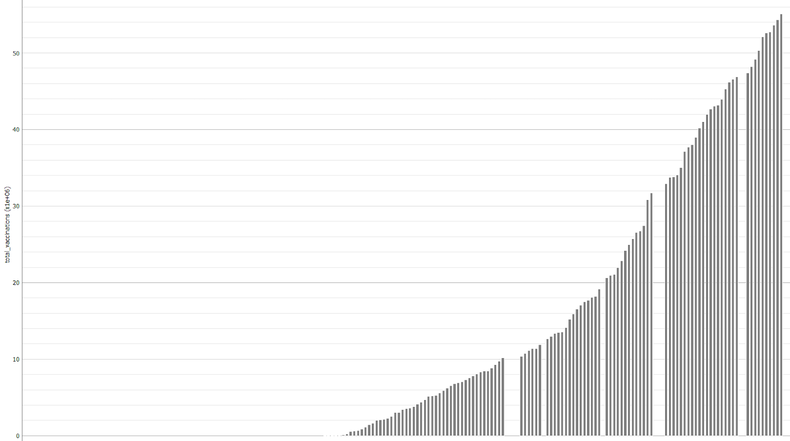

# Projeto `Avaliação do impacto da subnotificação na predição de indicadores de evolução da COVID - 19 (número de casos, mortes e hospitalização)`
# Project `Evaluation of the impact of underreporting on the prediction of COVID - 19 evolution indicators (number of cases, deaths and hospitalization)`

# Apresentação

O presente projeto foi originado no contexto das atividades da disciplina de pós-graduação [*Ciência e Visualização de Dados em Saúde*](https://github.com/datasci4health/home), oferecida no primeiro semestre de 2021, na Unicamp.

 |Nome  | RA | Especialização|
 |--|--|--|
 | Diogo Brandão  | 227099  | Computação|
 | Juliana Rodrigues Pinto | 107619  | Saúde|
 | Laura Moretti Aiello  | 178176  | Saúde|
 | Miguel Henrique Nicodemus de Souza Pinto  | 156777  | Computação|

# Descrição Resumida do Projeto

A Covid 19 está afetando a população brasileira de uma forma complexa. O presente trabalho objetiva avaliar a evolução do vírus em diferentes países para identificar a existência de subnotificação nos números de casos, mortes e hospitalizações e tentar predizer o impacto da subnotificação durante a pandemia.

[Video Projeto Ciência e Visualização de Dados em Saúde](https://drive.google.com/file/d/1QKpGMJFm76yzsFowA0n4_coLLJ7RuWdh/view?usp=sharing)

# Perguntas de Pesquisa

Como pressupostos fundamentais para orientação do projeto foram utilizadas as seguintes perguntas de pesquisa:

- Qual o presente cenário do número de casos e de mortes em diferentes países?
- Houve subnotificação nos números de casos e morte pra diferentes países?
- Como os casos de subnotificação podem interferir nas predições de indicadores futuros de COVID-19?
- Quais foram os efeitos da vacinação nos indicadores de subnotificação?

# Metodologia

Propõe-se o uso das seguintes metodologias:

- CRISP-DM
- Aprendizagem de máquina
- Análise estatística

# Bases de Dados e Evolução

## Bases Estudadas mas Não Adotadas

As bases de dados abaixo foram avaliadas, porém descartadas pelos motivos apresentados abaixo:

Base de Dados | Endereço na Web | Resumo descritivo
----- | ----- | -----
Distribuição Geográfica de COVID-19 pelo mundo | https://www.ecdc.europa.eu/en/publications-data/download-todays-data-geographic-distribution-covid-19-cases-worldwide | Base que contém dados históricos do ano de 2020 com os indicativos: número de casos, mortes, país, continentes, casos cumulativos de COVID por 14 dias, e dados populacionais. Não adotada, pois as análises podem ser feitas pela base adotada e mais completa.

Para avaliação da aplicabilidade da base de dados ‘Distribuição Geográfica de COVID-19 pelo mundo” com os objetivos propostos por esse projeto, foram analisadas as variáveis números de casos e mortes, comparando a partir do tempo, localização geográfica e número da população. O restante das informações puderam ser excluídas uma vez que não contemplavam os objetivos estabelecidos. 
A partir da análise exploratória dos dados, verificou-se uma forte correlação entre o número de casos e mortes (0,823). As correlações se mantiveram positivas para as variáveis: números de casos e população (0,466) e número de mortes e população (0,460). 

Correlação

Os resultados das estatísticas descritivas das variáveis numéricas mais relevantes são apresentados na Figura abaixo. 

Estatísticas descritivas

As variáveis também podem ser comparadas e estudadas a partir dos gráficos de dispersão conforme demonstrado.

Gráfico de dispersão do número de casos em função do tempo (meses)

Gráfico de dispersão do número de mortes em função do tempo (meses)

Observa-se um aumento no número de casos de COVID-19 ao longo dos meses, com uma prevalência no continente americano. Já o número de mortes apresentou maiores índices no mês de abril e dezembro, também com prevalência no continente americano. 

Embora a base de dados apresente dados relevantes, essa não foi considerada uma vez que essas análises puderam também ser realizadas de forma mais completa e mais condizentes com o objetivo proposto a partir da base adotada. 

Base de Dados | Endereço na Web | Resumo descritivo
----- | ----- | -----
Teste para COVID-19 | https://www.ecdc.europa.eu/en/publications-data/covid-19-testing | A base traz informações sobre as quantidades de testes realizados e positivados por semana e país. Não adota por não conter todos os países que devem ser considerados no projeto.

Para avaliação dessa base de dados, foram selecionados os parâmetros: país, novos casos, testes feitos e testes positivos. Os dados considerados não relevantes foram excluídos.
A análise exploratória desses dados foi feita a partir do estudo de correlação entre variáveis, gráficos de dispersão e estatísticas descritivas. 

**Correlação**

Conforme apresentado na figura, o número de casos obteve uma forte correlação com a taxa de testes positivados (0,809) e com o número de testes feitos (0,683). O número de população também apresentou forte correlação com os testes feitos (0,661) e novos casos (0,630). Desse modo, podemos constatar que quanto maior o número da população, mais testes serão feitos e maior a taxa de positivos e, portanto, mais novos casos ocorrerão.

**Gráfico de dispersão taxa de testes feitos em função do número de novos casos - correlação positiva**

**Gráfico de dispersão taxa de testes positivos em função do número de novos casos**

Verifica-se uma correlação positiva entre número de novos casos e testes feitos no primeiro gráfico enquanto que no segundo gráfico, não é constatada uma correlação clara entre os novos casos e a taxa de testes positivos.

**Estatísticas descritivas das variáveis**

Embora essa base de dados contenha informações relevantes a serem utilizadas, por exemplo, para cálculo dos casos não notificados, essa não apresenta todos os países de interesse para as avaliações propostas pelo projeto,  tendo sido, portanto, dada preferência à base de dados adotada mais completa. 

## Bases Estudadas e Adotadas

As bases abaixos foram escolhidas para a análise do projeto.

Base de Dados | Endereço na Web | Resumo descritivo
----- | ----- | -----
owid-covid-data | https://github.com/owid/covid-19-data/tree/master/public/data | O dataset utilizado contém dados relacionados à COVID-19 e é mantido pela Our World in Data, uma plataforma digital especializada em expor dados de pesquisa de forma interativa. O dataset é atualizado diariamente e contém dados sobre casos confirmados, óbitos, hospitalização, testes e vacinação, além de informações relacionadas à população, IDH, expectativa de vida, entre outras variáveis de interesse a pesquisa.

Nesta análise utilizou-se o [Dataset Covid](https://github.com/MiguelNicodemus/DataSci-Pharmacologicals/blob/main/data/raw/owid-covid-data.csv), com 91.024 entradas de dados, 40.1% de dados faltantes e 59 features. As features (características) da base de dados estão descritas abaixo:

- ISO_Code (dado categórico): Código de identificação do país.
- Continent (dado categórico): Continente no qual o país está localizado.
- Location (dado categórico): Nome do país.
- Date (dado categórico): Data de notificação
- Total_cases (dado numérico): Número de casos acumulados
- New_cases (dado numérico): Número de novos casos por data de notificação
- New_cases_smoothed (dado numérico): ?
- Total_deaths (dado numérico): Número de óbitos acumulados.
- New_deaths (dado numérico): Número de  óbitos por data de notificação
- New_deaths_smoothed (dado numérico): ?
- Total_cases_per_million (dado numérico): Número de casos acumulados por 1 milhão de habitantes.
- New_cases_per_million (dado numérico): Número de novos casos por 1 milhão de habitantes por data de notificação.
- New_cases_smoothed_per_million (dado numérico): ?
- Total_deaths_per_million (dado numérico): Número de óbitos acumulados por 1 milhão de habitantes.
- New_deaths_per_million (dado numérico): Número de novos óbitos por 1 milhão de habitantes por data de notificação.
- New_deaths_smoothed_per_million (dado numérico): ?
- Reproduction_rate (dado numérico): Taxa de reprodução da Covid-19.
- ICU_patients (dado numérico): Número total de pacientes na unidade de terapia intensiva.
- ICU_patients_per_million (dado numérico): Número de pacientes na unidade de terapia intensiva por 1 milhão de habitantes.
- Hosp_patients (dado numérico): Número total de pacientes hospitalizados.
- Hosp_patients_per_million (dado numérico): Número total de pacientes hospitalizados por 1 milhão de habitantes.
- Weekly_ICU_admissions (dado numérico): Número de pacientes admitidos semanalmente na unidade de terapia intensiva.
- Weekly_ICU_admissions_per_million (dado numérico): Número de pacientes admitidos semanalmente na unidade de terapia intensiva por 1 milhão de habitantes.
- Weekly_hosp_admissions (dado numérico): Número de pacientes hospitalizados semanalmente.
- Weekly_hosp_admissions_per_million (dado numérico): Número de pacientes hospitalizados semanalmente por 1 milhão de habitantes.
- New_tests (dado numérico): Número de novos testes para Covid-19 realizados na data de notificação.
- Total_tests (dado numérico): Número total de testes para Covid-19 realizados.
- Total_tests_per_thousand (dado numérico): Número total de testes para Covid-19 realizados por mil habitantes.
- New_tests_per_thousand (dado numérico): Número de novos testes para Covid-19 realizados por mil habitantes na data de notificação.
- New_tests_smoothed (dado numérico): ?
- New_tests_smoothed_per_thousand (dado numérico): ?
- Positive_rate (dado numérico): Taxa de resultados positivos para teste de Covid-19.
- Tests_per_case (dado numérico): ?
- Tests_units (categórico): ?
- Total_vaccionations (dado numérico): Número total de vacinas aplicadas.
- People_vaccinated (dado numérico): Número total de pessoas vacinadas.
- People_fully_vaccinated (dado numérico): Número de pessoas vacinadas com a primeira e segunda dose.
- New_vaccinations (dado numérico): Número de vacinas aplicadas por data de notificação.
- New_vaccinations_smoothed (dado numérico): ?
- Total_vaccinations_per_hundred (dado numérico): Número total de vacinas aplicadas por cem habitantes.
- People_vaccinated_per_hundred (dado numérico): Número total de pessoas vacinadas por cem habitantes.
- People_fully_vaccinated_per_hundred  (dado numérico): Número de pessoas vacinadas com a primeira e segunda dose por cem habitantes.
- New_vaccinations_smoothed_per_million (dado numérico): ?
- Stringency_index (dado numérico):  Índice de Estringência de Resposta Governamental: medida baseada em nove indicadores de resposta, incluindo encerramentos de escolas, encerramentos de locais de trabalho, e proibições de viagens, redimensionada para um valor de 0 a 100 (100 = o mais rigoroso). 
- Population (dado numérico): Número de habitantes.
- Population_density (dado numérico): Densidade populacional.
- Median_age (dado numérico): Idade média da população.
- Aged_65_older (dado numérico): Número de habitantes com 65 anos ou mais (e menores de 70 anos). 
- Aged_70_older (dado numérico): Número de habitantes com 70 anos ou mais. GDP_per_capita (dado numérico): Produto Interno Bruto (PIB) per capita - soma das riquezas do país dividida pela população do país.
- Extreme_poverty (dado numérico): Porcentagem da população que vive em pobreza extrema.
- Cardiovasc_death_rate (dado numérico): Taxa de óbito por doenças cardiovasculares na população.
- Diabetes_prevalence (dado numérico): Porcentagem de prevalência de diabetes na população.
- Female_smokers (dado numérico): Porcentagem de fumantes do sexo feminino na população.
- Male_smokers (dado numérico): Porcentagem de fumantes do sexo masculino na população.
- Handwashing_facilities (dado numérico): Número de habitantes com acesso a instalações adequadas para higiene das mãos.
- Hospital_beds_per_thousand (dado numérico): Número de leitos hospitalares por mil habitantes.
- Life_expectancy (dado numérico): Expectativa de vida.
- IDH  (dado numérico): Índice de desenvolvimento humano.

**Dataset Covid após remoção das características irrelevantes**

A partir do Dataset Covid foram selecionadas somente as características (features) relevantes para as análises que serão realizadas, a fim de responder às perguntas de pesquisa propostas no presente projeto. Desta maneira, foram selecionadas somente as colunas com as seguintes features:

- Date
- Location
- Total_cases
- Total_cases_per_million
- New_cases
- Total_deaths
- Total_deaths_per_million
- New_deaths
- Total_vaccinations
- New_vaccinations
- Population
- Population_density
- Median_age
- Life_expectancy
- IDH

**Análise do cenário mundial da pandemia de Covid-19, considerando os dados relativos ao número de casos, óbitos e vacinação.**

Abaixo estão apresentados os gráficos de distribuição do total de casos (cumulativo), casos diários, total de óbitos (cumulativo), óbitos diários, total de vacinas (cumulativo) e pessoas vacinadas por dia, a nível mundial. 
Os gráficos apresentam a distribuição das notificações realizadas entre 02-11-2020 e 19-05-2021. Devido à limitação do Orange, que permite somente o input de 200 dados para a elaboração do gráfico de distribuição, foram selecionados somente os dados referentes às 200 notificações mais atuais.

*Gráfico 1: Total de casos acumulados de Covid-19 no mundo.*

*Gráfico 2: Número de casos diários de Covid-19 no mundo.*

*Gráfico 3: Total de óbitos acumulados por Covid-19 no mundo.*

*Gráfico 4: Número de óbitos diários por Covid-19 no mundo.*

*Gráfico 5: Total acumulado de vacinas aplicadas no mundo.*

*Gráfico 6: Número de pessoas vacinadas diariamente no mundo.*

**Features statistics**

As figuras 1 e 2 apresentam os gráficos de distribuição e estatística descritiva do dataset completo e das variáveis (features) relevantes que serão avaliadas pelo grupo.

*Figura 2. Gráfico de distribuição e estatística descritiva das variáveis selecionadas.*

A partir dos gráficos apresentados nas figuras 1 e 2 é possível inferir, que de modo geral, as variáveis do dataset não apresentam uma distribuição normal.
Para as variáveis relacionadas à vacinação é possível verificar uma alta porcentagem de dados faltantes. Em alguns casos é possível observar que 70% dos dados estão faltando.
No entanto, é importante ressaltar que o dataset apresenta dados de notificações realizadas desde janeiro de 2020, e a vacinação iniciou em alguns países a partir de dezembro de 2020. 

**Correlações entre características**

A correlação entre duas variáveis apresenta uma relação estatística entre elas. Variáveis fortemente correlacionadas (valor de r ⦥ 0.7) podem indicar a influência de uma sobre a outra.
A correlação entre as variáveis selecionadas foi avaliada aplicando-se o coeficiente de Spearman, uma vez que as variáveis não apresentam uma distribuição normal.
O resultado apresentado abaixo mostra uma forte correlação entre as variáveis: casos acumulados e óbitos acumulados; casos diários e óbitos acumulados; casos diários e casos acumulados; vacinação diária e total vacinados; casos diários e óbitos diários; óbitos diários e óbitos acumulados; óbitos diários e casos acumulados.

**Análise do cenário nacional da pandemia de Covid-19, considerando os dados relativos ao número de casos, óbitos e vacinação**

Abaixo estão apresentados os gráficos de distribuição do total de casos (cumulativo), casos diários, total de óbitos (cumulativo), óbitos diários, total de vacinas (cumulativo) e pessoas vacinadas por dia no Brasil. 
Os gráficos apresentam a distribuição das notificações realizadas entre 02-11-2020 e 19-05-2021. Devido à limitação do Orange, que permite somente o input de 200 dados para a elaboração do gráfico de distribuição, foram selecionados somente os dados referentes às 200 notificações mais atuais.

*Gráfico 7: Total de casos acumulados de Covid-19 no Brasil.*

*Gráfico 8: Número de casos diários de Covid-19 no Brasil.*

*Gráfico 9: Total de óbitos acumulados por Covid-19 no Brasil.*

*Gráfico 10: Número de óbitos diários por Covid-19 no Brasil.*

*Gráfico 11: Total acumulado de vacinas aplicadas no Brasil.*

*Gráfico 12: Número de pessoas vacinadas diariamente no Brasil.*

**Features statistics**

A figuras 3 apresenta o gráfico de distribuição e estatística descritiva das variáveis (features) selecionadas, considerando as notificações registradas no Brasil.

*Figura 3. Gráfico de distribuição e estatística descritiva das variáveis selecionadas (dados Brasil) .*

De acordo com os dados visualizados na figura 3 é possível inferir que as variáveis não apresentam uma distribuição normal.
Assim como no cenário mundial, as variáveis relacionadas à vacinação apresentam alta porcentagem de dados faltantes. Para o Brasil esta porcentagem é relativamente maior, pois, a vacinação no país começou a partir de janeiro de 2021.

**Correlações entre características**

A correlação entre as variáveis selecionadas foi avaliada aplicando-se o coeficiente de Spearman, uma vez que as variáveis não apresentam uma distribuição normal.
O resultado apresentado abaixo mostra uma forte correlação  (valor de r ⦥ 0.7) entre as variáveis: casos acumulados e óbitos acumulados; casos diários e óbitos diários; casos diários e casos acumulados.
É possível observar uma correlação moderada (valor de r ⦥ 0.5) entre as variáveis: vacinação diária e total vacinados; casos diários e óbitos acumulados; óbitos diários e óbitos acumulados; óbitos diários e casos acumulados.

**Comparação países**
**Densidade populacional x Total de mortes**

Como podemos observar, a densidade populacional não tem correlação linear direta com o total de óbitos por país, vemos entradas com baixa densidade populacional e alto número de óbitos, assim como o contrário. Para tornar este um modelo mais robusto, talvez será necessário analisar essas variáveis em conjunto.

**População x Total de mortes**

Novamente, assim como na análise de densidade populacional, o comportamento é extremamente similar. Talvez é o caso de análise conjunto ou aplicação de um modelo polinomial, com todos os devidos cuidados para evitar o overfitting.

**Expectativa de vida x Total de mortes por milhão**

**IDH x Total de mortes por milhão**

**Correlações**

### Integração entre Bases e Análise Exploratória

N/A

# Ferramentas

As ferramentas optadas para execução do projeto em questão são:

- Orange
- Graphpad
- Python
- R

# Cronograma

Para o desenvolvimento das etapas propostas para este projeto, as atividades seguiram a metodologia CRISP-DM. O tempo necessário para cada etapa está descrito na tabela a seguir:

|Atividade/Semana | 1 | 2 | 3 | 4 | 5 | 6 | 7 | 8 | 9 | 10 | 11 | 12 |
|---|---|---|---|---|---|---|---|---|---|---|---|---|
|Entendimento do Negócio | x |  |  |  |  |  |  |  |  |  |  |  |
|Entendimento dos Dados |  | x | x |  |  |  |  |  |  |  |  |  |
|Preparação dos Dados |  |  |  | x | x | x |  |  |  |  |  |  |
|Modelagem |  |  |  |  |  |  | x | x | x | x |  |  |
|Avaliação |  |  |  |  |  |  |  |  |  |  | x | x |

